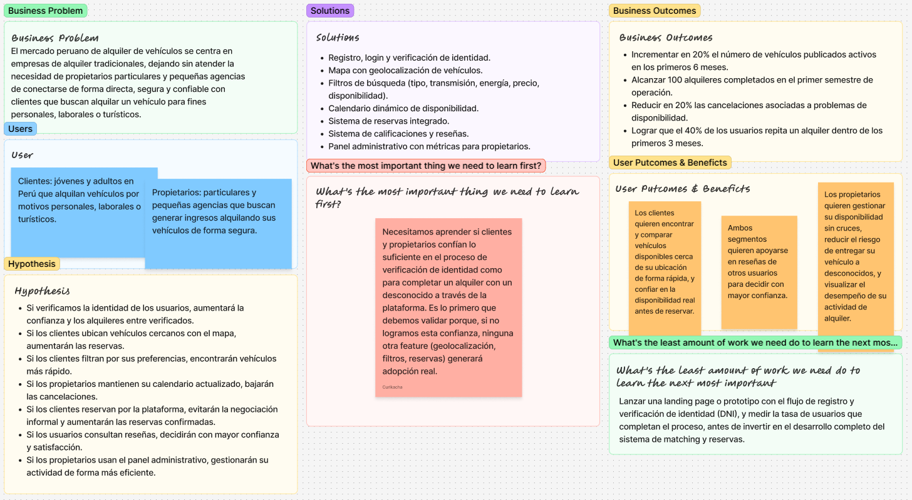

# Capítulo I: Introducción

---

## 1.1. Startup Profile
### 1.1.1. Descripción de la Startup
**Veygo** es una plataforma digital innovadora diseñada para simplificar y optimizar el proceso de alquiler vehicular (automóviles y motocicletas) entre arrendadores (propietarios particulares o agencias) y potenciales clientes. La solución integra un ecosistema digital seguro e intuitivo que facilita la verificación de identidad (login), la búsqueda geolocalizada mediante un mapa en tiempo real para ubicar vehículos cercanos al punto de entrega, la selección personalizada a través de filtros especializados (como tipo de energía: eléctrico, o transmisión: manual), un calendario dinámico de disponibilidad actualizado al instante y un panel administrativo completo con métricas clave como el total de vehículos activos y transacciones completadas.

**Misión:** Nuestra misión es proporcionar una plataforma segura y confiable donde ofrecer tus vehículos como alquiler o buscar un vehículo para alquilar.
**Visión:** Nuestra vision es la de convertirnos en la plataforma de alquiler de vehículos más confiable y segura del Perú, donde tanto los dueños como los clientes 
puedan interactuar de una manera rápida y sencilla.

### 1.1.2. Perfiles de integrantes del equipo

| Foto de Perfil | Información del Integrante |
| :---: | :--- |
|  | **Nombre:** Eddo Su Caletti  **Rol:** Team leader  **Descripción:** Me llamo Eddo Su Caletti estudió la carrera de ingeniería de software estoy en el 5 ciclo me considero una persona amable y graciosa me encanta salir con mis amigos a pasear en bicicleta o jugar videojuegos además espero poder ser de ayuda para mis compañeros con todos los problemas que ellos tengan.|
|  | **Nombre:** Ivonne Beatriz Ibañez Torres **Rol:** FullStack Developer **Descripción:** Sexto ciclo de la carrera de Ingeniería de software. Encargada del desarrollo de la interfaz responsive, integración de vistas de mapas, filtros de búsqueda por tipo de vehículo (autos/motos, eléctrico/manual) y calendarios interactivos. Con manejo en C++ y Python, conocimientos en diseño y patrones de software, PostgreSQL, MongoDB, Java ,Spring Boot y Node.js.|
|  | **Nombre:** [Nombre del Integrante 3] **Rol:** Backend Developer **Descripción:** Responsable de la construcción de las APIs RESTful, lógica de la sincronización de disponibilidad de vehículos en tiempo real y la gestión del módulo de autenticación (login). |
|  | **Nombre:** [Marlon Flores Siguas] **Rol:** Software Architect & Cloud Engineer **Descripción:** Me llamo Marlon Flores Siguas, estudio la carrera de Ingeniería de Software y actualmente estoy en el 5 ciclo. Me considero una persona responsable, perseverante y con disposición para aprender y trabajar en equipo. Me gusta desarrollar proyectos de software, aprender nuevas tecnologías y buscar soluciones a los problemas que se presentan durante el desarrollo. Espero poder aportar mis conocimientos y ayudar a mis compañeros para lograr los objetivos del proyecto. |
|  | **Nombre:** [Nombre del Integrante 5] **Rol:** QA Analyst & Data Specialist **Descripción:** Encargado de asegurar la calidad de los flujos de reserva, validaciones de disponibilidad sin solapamientos y la gestión de métricas del panel administrativo. |

---
## 1.2. Solution Profile

### 1.2.1. Antecedentes y problemática
El mercado de alquiler de transporte personal (carros y motos) enfrenta serias ineficiencias en la coordinación entre arrendadores y clientes debido a procesos informales, falta de transparencia y lentitud en la comunicación.

**Problemáticas identificadas:**
* **Para los clientes:**
  * Dificultad para localizar vehículos (carros o motos) disponibles en su zona inmediata de entrega.
  * Falta de filtros claros para elegir preferencias específicas como transmisiones manuales o motorizaciones eléctricas.
  * Incertidumbre sobre la disponibilidad real del vehículo al coordinar.

* **Para los rentadores:**
  * Ausencia de herramientas para gestionar la disponibilidad de su flota en tiempo real sin cruce de fechas.
  * Carencia de paneles de control para medir el desempeño de su negocio (transacciones completadas y volumen de vehículos).
  * Inseguridad al entregar vehículos sin un proceso claro de autenticación y verificación de identidad.

Con el propósito de entender mas a fondo las necesidades de nuestros usuarios, analizaremos sus antecedentes y la problemática utilizando la técnica **5W’s & 2H’s**. Según Progress Lean (2014), esta herramienta se basa en siete preguntas clave: What? (¿Cuál es el problema?), When? (¿Cuándo estamos viendo el problema?¿En qué momento del día y/o del progreso en cuestión?), Where? (¿Dónde estamos viendo este problema?¿En dónde estamos viendo el problema?), Who? (¿A quién le sucede? ¿A quienes afecta?), Why? (¿Porqué sucede el problema?), How? (¿Cómo ocurre el problema?) y How Much? (¿Cuántos problemas se dan en un día?¿Una semana?¿En un mes?¿Cuánto dinero está implicado?).

 **What**
_¿Cuál es el problema?_
La escasez de opciones tanto web como móviles para el alquiler de vehículos en Perú, 
que ofrezcan una plataforma segura y confiable para ambas partes involucradas en el alquiler.
**When**
_¿Cuándo sucede el problema?_
El problema sucede a la hora de buscar plataformas que ofrezcan alquileres de vehículos a dueños directos, ya que la mayoría de plataformas existentes son de empresas grandes que no ofrecen una atención personalizada.
Del mismo modo los dueños no cuentan con una plataforma que ofrezca seguridad para el alquiler de sus vehículos

 **Where**
_¿Dónde surge el problema?_
Este problema surge en Perú, donde la mayoría de plataformas de alquiler de vehículos son de empresas grandes que no ofrecen una atención personalizada.

 **Who**
_¿Quiénes se ven perjudicados por esta situación?_
Se ven perjudicados jóvenes y adultos peruanos que, por un lado, no encuentran una plataforma confiable donde poder ofrecer sus vehículos y, por otro
lado, los clientes que buscan alquilar un vehículo y no encuentran una plataforma que ofrezca una atención directa con el dueño.

 **Why**
_¿Cuáles son las causas del problema?_
La enorme presencia de empresas grandes ya establecidas, las cuales cuentan con una flota determinada, estás al ser un referente del arrendamiento
de vehículos opacan a los dueños particulares que buscan ofrecer sus vehículos de manera directa

 **How**
_¿En qué condiciones los clientes usan nuestro producto?_
Implementando una plataforma segura que garantice tanto al cliente como al dueño una experiencia segura y confiable 
incorporando un sistema de evaluación y reseñas, donde ambos puedan calificar su experiencia de alquiler, asi como exigiendo documentos
importantes tales como DNI, Brevete, etc.

 **How much**
_¿Cuánto impacto tiene el problema?_
El problema afecta tanto a propietarios que buscan generar ingresos con sus vehículos como a usuarios que necesitan alquilar un auto de manera segura. En Lima, el precio promedio de alquiler de un vehículo es de aproximadamente S/120 por día, por lo que cada alquiler representa una oportunidad económica para los propietarios. Además, el crecimiento del turismo nacional e internacional incrementa la cantidad de potenciales usuarios que requieren alternativas de transporte.

### 1.2.2 Lean UX Process
Lean UX es un enfoque de diseño de experiencia de usuario adaptado a entornos de trabajo ágils, que combina tre bases conceptuales: los principios de desing thinking centrados en las necesidades reales del usuario, las prácticas del desarrollo ágil orientadas al trabajo iterativo e incremental en equipos multidiciplinarios, y los principios de Lean Starup, enfocados en validar hipótesis de negocio con el menor desperdicio de recursos posible (Gothelf & Seiden, 2021). Su propósito central es reducir el riesgo de construir soluciones que no generen valor, promoviendo la colaboración constante entre el equipo y los usuarios finales antes de inventir en el desarrollo.

Siguiendo la 3ra edición del libro, que organiza el proceso alrededor del Lean UX Canvas, el equipo desarrollo cuatro etapas para transformar la idea de Veygo en una propuesta validada: la declaración del **Problem Statement**, que enmarca el problema desde la perspectiva de propietarios y arrendatarios de vehículos; la identificación de **Assumptions**, donde se explicitan las creencias del equipo sobre el negocio, los usuarios y las funcionalidades necesarias; la formulación de **Hypothesis Statements**, que traducen dichas creencias en enunciados comprobables; y finalmente el **Lean UX Canvas**, que consolida visualmente todos los elementos anteriores.

#### 1.2.2.1. Lean UX Problem Statements

El estado actual del mercado de alquiler de vehículos en Perú se ha enfocado principalmente en clientes que buscan alquilar automóviles o motocicletas mediante empresas de alquiler establecidas, así como en propietarios y agencias que ofrecen sus vehículos mediante canales tradicionales o plataformas con opciones limitadas de gestión.

Lo que los productos y servicios existentes no logran abordar completamente es la necesidad de contar con un espacio digital que conecte de manera directa, segura y confiable a propietarios y clientes, permitiendo localizar vehículos disponibles, conocer su disponibilidad real, seleccionar características específicas y establecer una relación transparente entre ambas partes.

Nuestro producto, Veygo, abordará esta brecha mediante una plataforma digital que centraliza la búsqueda, publicación y gestión de alquileres de automóviles y motocicletas, incorporando geolocalización, filtros de búsqueda, calendario de disponibilidad, autenticación y verificación de identidad, además de un sistema de calificaciones y reseñas que contribuya a generar confianza entre los usuarios.

Nuestro enfoque inicial estará dirigido a jóvenes y adultos en Perú que necesitan alquilar un vehículo para sus actividades personales, laborales o turísticas, y a propietarios particulares o pequeñas agencias que desean generar ingresos mediante el alquiler de sus automóviles o motocicletas de manera segura.

Sabremos que tenemos éxito cuando observemos un incremento en el número de usuarios registrados, vehículos publicados, búsquedas y alquileres completados, así como una reducción de cancelaciones relacionadas con problemas de disponibilidad o desconfianza entre clientes y propietarios y un alto nivel de satisfacción de los usuarios.

#### 1.2.2.2. Lean UX Assumptions

**Business Assumptions**
- Creemos que existe una oportunidad de negocio en el mercado peruano de alquiler de automóviles y motocicletas debido a la necesidad de conectar propietarios y clientes mediante canales digitales.
- Creemos que Veygo puede diferenciarse de las empresas tradicionales de alquiler ofreciendo una plataforma que permita a propietarios particulares publicar y gestionar sus vehículos directamente.
- Creemos que la confianza y la seguridad serán factores determinantes para que los usuarios decidan utilizar una plataforma de alquiler entre particulares.
- Creemos que Veygo podrá generar ingresos mediante un modelo basado en comisiones por las transacciones de alquiler realizadas dentro de la plataforma.
- Creemos que inicialmente Lima será un mercado adecuado para validar el modelo de negocio debido a la concentración de usuarios, vehículos y actividades comerciales y turísticas.

**Business Outcome Assumptions**
- Creemos que el éxito del negocio se reflejará en un crecimiento sostenido del número de usuarios registrados en Veygo.
- Creemos que un indicador importante de éxito será el incremento del número de vehículos publicados y disponibles para alquiler.
- Creemos que el número de alquileres completados será una métrica fundamental para evaluar la adopción de la plataforma.
- Creemos que una reducción en las cancelaciones relacionadas con problemas de disponibilidad indicará que la plataforma está solucionando una de las principales dificultades del proceso de alquiler.
- Creemos que un alto porcentaje de usuarios que vuelvan a utilizar la plataforma demostrará que Veygo genera suficiente valor para fomentar la retención.
- Creemos que un incremento en la percepción de confianza y seguridad de los usuarios se reflejará en una mayor tasa de alquileres completados entre usuarios verificados.
- Creemos que la satisfacción de los propietarios con la gestión de su actividad de alquiler será un indicador de retención de este segmento en la plataforma.

**User Assumptions**
- Creemos que los principales usuarios de Veygo serán jóvenes y adultos que necesitan alquilar automóviles o motocicletas por periodos determinados.
- Creemos que los clientes utilizarán la plataforma para viajes, actividades laborales, necesidades personales y turismo.
- Creemos que los propietarios particulares utilizarán Veygo para ofrecer sus vehículos y generar ingresos adicionales.
- Creemos que pequeñas agencias de alquiler podrán utilizar Veygo para ampliar la visibilidad y gestionar su oferta de vehículos.
- Creemos que tanto clientes como propietarios necesitarán registrarse y proporcionar información que permita verificar su identidad antes de realizar transacciones.

**User Outcome and Benefit Assumptions**
- Creemos que los clientes desean encontrar vehículos disponibles cerca de su ubicación de manera rápida y sencilla.
- Creemos que los clientes desean comparar vehículos según características como tipo de vehículo, transmisión, tipo de energía, precio y disponibilidad.
- Creemos que los clientes desean conocer con anticipación la disponibilidad real del vehículo para evitar problemas durante la reserva.
- Creemos que los propietarios desean gestionar fácilmente la disponibilidad de sus vehículos y evitar cruces entre reservas.
- Creemos que los propietarios desean contar con mecanismos que les permitan reducir el riesgo asociado a entregar sus vehículos a personas desconocidas.
- Creemos que ambos segmentos desean contar con información y reseñas de otros usuarios para tomar decisiones de alquiler con mayor confianza.
- Creemos que los propietarios desean visualizar el desempeño de sus vehículos, reservas e ingresos en un solo lugar para tomar mejores decisiones sobre su actividad de alquiler.

**Feature Assumptions**
- Creemos que un sistema de registro, inicio de sesión y verificación de identidad permitirá aumentar la seguridad y confianza entre clientes y propietarios.
- Creemos que un mapa con geolocalización de vehículos permitirá a los clientes encontrar vehículos disponibles cerca de su ubicación de manera más rápida.
- Creemos que un sistema de filtros de búsqueda permitirá a los clientes encontrar vehículos que se ajusten a sus necesidades y preferencias.
- Creemos que un calendario dinámico de disponibilidad permitirá a los propietarios gestionar las fechas de sus vehículos y reducir conflictos entre reservas.
- Creemos que un sistema de reservas permitirá a los clientes seleccionar y solicitar un vehículo de manera organizada, reduciendo la dependencia de procesos informales de comunicación.
- Creemos que un sistema de calificaciones y reseñas para clientes y propietarios permitirá generar mayor confianza y transparencia dentro de la plataforma.
- Creemos que un panel administrativo para propietarios permitirá visualizar métricas como vehículos activos, reservas y transacciones completadas, facilitando la gestión de su actividad de alquiler.

#### 1.2.2.3 Lean UX Hypothesis Statements
**Hypothesis Statement 1 — Registro y verificación**
**Creemos** que lograremos incrementar la tasa de alquileres completados entre usuarios verificados, si clientes y propietarios logran sentirse seguros al interactuar y realizar alquileres con usuarios cuya identidad ha sido verificada, mediante un sistema de registro, inicio de sesión y verificación de identidad.
**Sabremos** que nuestra hipótesis es válida si aumenta el porcentaje de usuarios que completan el proceso de registro y se incrementa la cantidad de alquileres realizados entre usuarios verificados.

**Hypothesis Statement 2 — Geolocalización**
**Creemos** que lograremos incrementar el número de búsquedas y reservas realizadas, si los clientes logran encontrar rápidamente vehículos disponibles cerca de su ubicación, mediante un mapa con geolocalización de vehículos.
**Sabremos** que nuestra hipótesis es válida si los usuarios utilizan el mapa para localizar vehículos y aumenta la conversión de búsquedas en reservas.

**Hypothesis Statement 3 — Filtros de búsqueda**
**Creemos** que lograremos incrementar la eficiencia de búsqueda y la cantidad de reservas, si los clientes logran encontrar vehículos que se ajusten a sus necesidades específicas, mediante un sistema de filtros por características como tipo de vehículo, transmisión, energía, precio y disponibilidad.
**Sabremos** que nuestra hipótesis es válida si los usuarios utilizan los filtros y disminuye el tiempo promedio necesario para encontrar un vehículo adecuado.

**Hypothesis Statement 4 — Disponibilidad**
**Creemos** que lograremos reducir los conflictos y cancelaciones de reservas, si los propietarios logran mantener actualizada la disponibilidad de sus vehículos, mediante un calendario dinámico de disponibilidad.
**Sabremos** que nuestra hipótesis es válida si disminuyen las reservas canceladas debido a conflictos de fechas y aumenta el porcentaje de vehículos con disponibilidad correctamente actualizada.

**Hypothesis Statement 5 — Reservas**
**Creemos** que lograremos incrementar el número de alquileres completados, si los clientes logran evitar la negociación informal por llamadas o mensajes y obtener la certeza de que su solicitud fue registrada correctamente, mediante un sistema de reservas integrado en la plataforma.

**Sabremos** que nuestra hipótesis es válida si aumenta el porcentaje de solicitudes de alquiler que culminan en una reserva confirmada.

**Hypothesis Statement 6 — Calificaciones y reseñas**
**Creemos** que lograremos incrementar la tasa de alquileres completados entre usuarios verificados, si clientes y propietarios logran consultar experiencias anteriores antes de realizar un alquiler, mediante un sistema de calificaciones y reseñas para ambas partes.
**Sabremos** que nuestra hipótesis es válida si aumenta el porcentaje de usuarios que consultan las reseñas y mejora la valoración promedio de confianza y satisfacción de la plataforma.

**Hypothesis Statement 7 — Panel administrativo**
**Creemos** que lograremos incrementar la eficiencia de gestión de los propietarios, si los propietarios particulares y pequeñas agencias logran conocer el desempeño de sus vehículos y transacciones, mediante un panel administrativo con métricas de vehículos activos, reservas y transacciones completadas.
**Sabremos** que nuestra hipótesis es válida si los propietarios utilizan regularmente el panel y disminuye el tiempo empleado en gestionar y consultar información sobre sus vehículos.

#### 1.2.2.4. Lean UX Canvas

---

## 1.3. Segmentos Objetivo
Veygo identifica dos segmentos objetivo complementarios dentro del dominio del alquiler de vehículos entre particulares: clientes que necesitan alquilar un vehículo y propietarios (particulares o pequeñas agencias) que buscan generar ingresos alquilando sus vehículos

**Segmento 1: Clientes (arrendatarios)**

_Características demográficas:_
Jóvenes y adultos, principalmente entre 25 y 44 años, residentes en Lima Metropolitana.
Perfil urbano, con acceso a smartphone y medios de pago digitales.
Motivaciones de uso: viajes por turismo interno, actividades laborales y necesidades personales de movilidad.

_Información de sustento:_
- Durante el primer semestre de 2024 se movilizaron más de 19 millones de turistas nacionales en el país, un incremento de 22% respecto al mismo periodo de 2023, según Mincetur, lo que evidencia una demanda creciente de movilidad para fines turísticos que Veygo puede capturar. 
- Un estudio de Kantar IBOPE Media identificó a los adultos jóvenes de 25 a 34 años y de 35 a 44 años como los grupos con mayor afinidad para viajar dentro del país
- El 68% de los peruanos encuestados planea realizar un viaje de tipo nacional, reforzando el tamaño de mercado potencial para servicios de movilidad y alquiler vehicular en el país.

Fuente: https://gestion.pe/economia/empresas/mas-peruanos-viajaran-en-2025-los-planes-de-la-generacion-z-turismo-viaje-promperu-kantar-tecnologia-noticia/

**Segmento 2: Propietarios particulares (arrendadores)**

_Caracteristicas demográficas:_
Adultos propietarios de automóviles o motocicletas en Lima, con interés en generar ingresos adicionales mediante el alquiler de sus vehiculos.

_Información de sustento:_
- Según la Encuesta Nacional de Hogares del INEI, en 2024 apenas el 11.73% de los hogares peruanos contaba con un automóvil o camioneta, mientras que la tenencia de motocicletas alcanzó el 16.73%, consolidándose la motocicleta como el vehículo más presente en los hogares del país.
- El parque de motocicletas en Perú supera los 4 millones de unidades, de las cuales aproximadamente 1.2 millones se concentran en Lima, siendo esta concentración un argumento clave para priorizar Lima como mercado inicial de validación (coherente con tu Business Assumption sobre Lima). 

Fuente: https://m.panamericana.pe/eldominical/locales/470867-crece-venta-motos-41-6-supera-160-mil-unidades-vendidas
