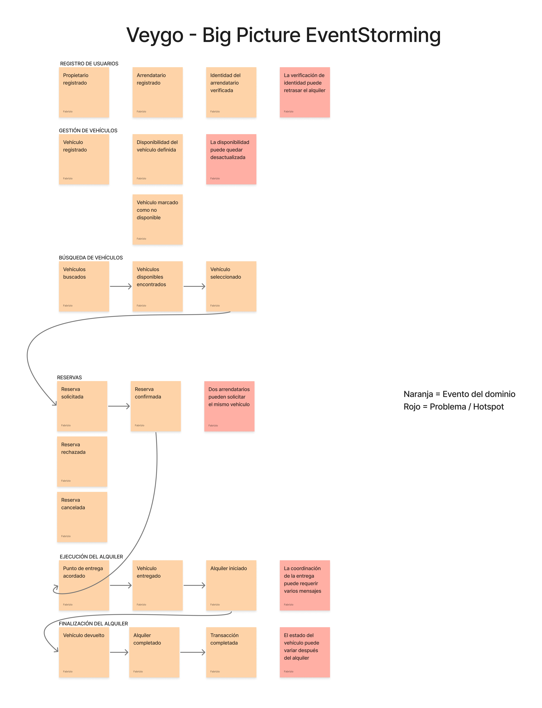
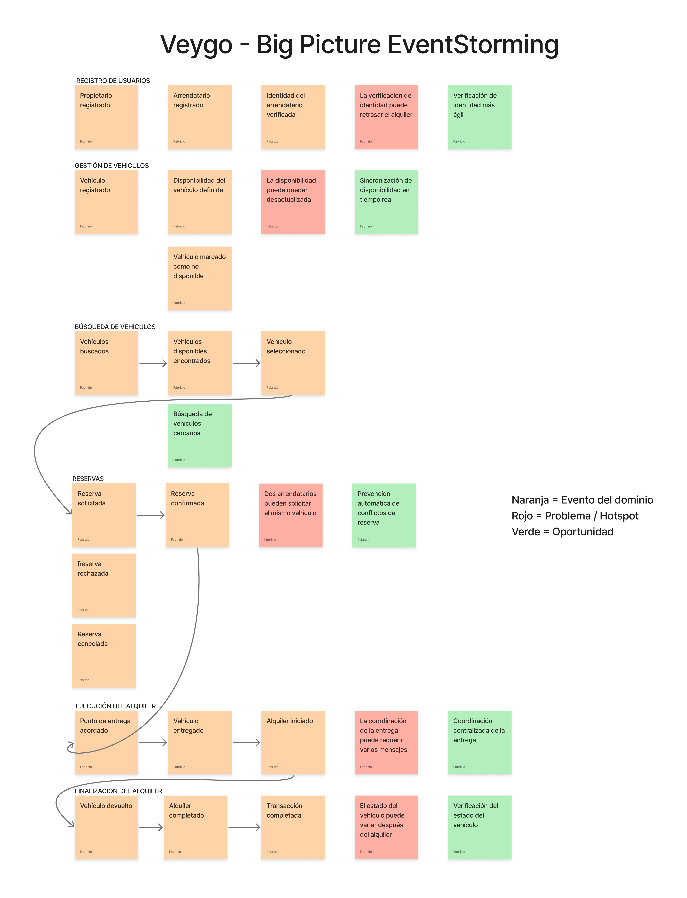

## Capítulo 2: Requirements Elicitation & Analysis
### 2.1. Competidores.

Previo al desarrollo de Veygo, nuestra aplicación de alquiler de autos, realizamos una búsqueda de las opciones que ya existen en el mercado, tanto locales como internacionales, con el fin de identificar qué funcionalidades ofrecen. Esta búsqueda nos permite entender el estado actual del sector y detectar los vacíos que nuestra propuesta puede cubrir.

- **Turo:** Plataforma internacional de alquiler de autos entre particulares (peer-to-peer). Permite a los propietarios publicar sus vehículos indicando disponibilidad mediante un calendario, mientras que los arrendatarios pueden filtrar por características del vehículo (tipo de transmisión, combustible, marca) y reservar directamente desde la app. Exige verificación de identidad y licencia de conducir antes de completar una reserva.

- **Getaround:** Servicio de carsharing que destaca por permitir a los usuarios ubicar vehículos disponibles cerca de su posición mediante un mapa interactivo, además de ofrecer acceso sin llaves físicas (keyless) mediante la app. Su verificación de identidad es un paso obligatorio antes del primer alquiler.

- **Peru Rent A Car:** Esta plataforma se especializa en el alquiler de autos en Perú. Ofrece una amplia gama de vehículos y opciones de alquiler, así como información sobre destinos turísticos en Perú. La plataforma permite a los usuarios comparar precios y reservar coches en línea, aunque carece de un mapa de proximidad o de un panel de métricas visible para los propietarios.

#### 2.1.1. Análisis competitivo.
|  | Competitive Analysis Landscape |
|---|---|
| ¿Por qué llevar a cabo este análisis? | Entender cómo Turo, Getaround y Peru Rent A Car resuelven hoy la verificación de identidad, la disponibilidad de vehículos, el filtrado por tipo de auto, el control administrativo del propietario y la coordinación del punto de entrega, para confirmar en qué puntos Veygo puede diferenciarse. |

| | | Veygo | Turo | Getaround | Peru Rent A Car |
| --- | --- | --- | --- | --- | --- |
| Perfil | Resumen | Aplicación que busca ofrecer una plataforma rápida y ágil para el alquiler de autos, con verificación de identidad, calendario en tiempo real, filtros por tipo de vehículo, panel administrativo con métricas y mapa de vehículos cercanos. | Plataforma líder en alquiler de autos entre particulares, con calendario de disponibilidad y filtros de búsqueda. | Servicio de carsharing enfocado en la localización de vehículos cercanos mediante mapa y acceso keyless. | Plataforma local que presenta un catálogo de vehículos para alquilar, con atención mediante WhatsApp. |
|  | Ventaja competitiva | Integra en una sola plataforma la verificación de identidad, el calendario actualizado, el filtrado por tipo de vehículo, el panel de métricas para el propietario y el mapa de cercanía para la entrega. | Amplia base de usuarios y flota disponible en varios países. | Fuerte enfoque en la geolocalización y la experiencia sin contacto. | Conocimiento del mercado local y trato directo con el cliente. |
| Perfil de Marketing | Mercado objetivo | Jóvenes y adultos desde los 20 a los 50 años, tanto propietarios como arrendatarios de vehículos en Perú. | Viajeros y particulares que buscan alquilar o rentar su propio vehículo. | Usuarios urbanos que necesitan un vehículo por periodos cortos. | Adultos peruanos que buscan alquilar un vehículo. |
|  | Estrategias de marketing | Marketing digital en redes sociales y colaboraciones con influencers. | Marketing digital y alianzas con aerolíneas/hoteles. | Publicidad digital enfocada en ciudades con alta congestión vehicular. | Patrocinio mediante búsquedas de Chrome. |
| Perfil de Producto | Productos y Servicios | Login con verificación de identidad, calendario de disponibilidad actualizado en tiempo real, filtro por tipo de carro (eléctrico, manual), panel administrativo con métricas (transacciones completadas, carros totales) y mapa de vehículos cercanos para la entrega. | Publicación de vehículos con calendario, mensajería entre usuarios, filtros de búsqueda por características. | Localización de vehículos en mapa, apertura remota del vehículo, tarificación por minuto/hora. | Catálogo de vehículos disponibles, atención directa por WhatsApp. |
|  | Precios y Costos | Comisión por transacción completada entre propietario y cliente. | Comisión variable según protección elegida por el propietario. | Tarifa por tiempo de uso más comisión de plataforma. | Ingreso directo mediante el alquiler. |
|  | Canales de distribución | Disponible en línea a través de la aplicación web y móvil. | Aplicación móvil y plataforma web. | Aplicación móvil. | Disponible en línea a través de la aplicación web. |
| Análisis FODA | Fortalezas | Verificación de identidad integrada, calendario en tiempo real, filtros específicos, panel de métricas y mapa de cercanía en una sola solución. | Gran cantidad de usuarios y flota, sistema de reputación consolidado. | Experiencia de geolocalización madura y acceso keyless. | Plataforma local, atención directa. |
|  | Debilidades | Nuevo competidor en un sector con jugadores ya establecidos. | Proceso de verificación puede resultar largo para nuevos usuarios. | Cobertura limitada a ciudades con alta densidad de vehículos. | No cuenta con calendario visible ni mapa de proximidad. |
|  | Oportunidades | Sin competidores locales que integren simultáneamente estos cinco flujos. | Expansión a nuevos mercados. | Alianzas con municipalidades para zonas de estacionamiento. | Digitalizar procesos hoy manuales (WhatsApp, Excel). |
|  | Amenazas | Sector competitivo con jugadores internacionales de gran escala. | Regulaciones locales sobre alquiler entre particulares. | Altos costos de mantenimiento de flota propia. | Ingreso de competidores con mejor tecnología. |

#### 2.1.2 Estrategias y tácticas frente a competidores.

A partir del Análisis FODA, se plantean las siguientes estrategias y tácticas preliminares que Veygo aplicará para afrontar las fortalezas de sus competidores, aprovechar sus debilidades, y actuar en el contexto de oportunidades y amenazas identificado:
 
**Frente a las fortalezas de los competidores:**
 
- Frente a la amplia base de usuarios y flota de **Turo**, Veygo se enfocará inicialmente en el mercado local peruano, ofreciendo una propuesta de valor integral (identidad, calendario, filtros, panel y mapa) que ningún competidor local replica hoy, en lugar de competir directamente por volumen de usuarios internacionales.
- Frente a la experiencia de geolocalización madura de **Getaround**, Veygo incorporará desde el inicio el mapa de vehículos cercanos como un flujo central del producto, y no como una función adicional, para no quedar rezagada en este aspecto.
- Frente al conocimiento del mercado local y el trato directo de **Peru Rent A Car**, Veygo mantendrá canales de soporte cercanos al usuario (chat dentro de la app) mientras digitaliza los procesos que hoy esa competencia resuelve manualmente.

**Para aprovechar las debilidades de los competidores:**
 
- El proceso de verificación largo que reportan usuarios de **Turo** se aprovechará ofreciendo un login de verificación de identidad más ágil, como diferenciador de experiencia de usuario.
- La cobertura limitada de **Getaround** a zonas de alta densidad vehicular se aprovechará priorizando el despliegue de Veygo en distritos donde la oferta de plataformas de carsharing es escasa.
- La falta de calendario visible y de mapa de proximidad en **Peru Rent A Car** se aprovechará comunicando activamente estos dos flujos como ventajas clave en la promoción de Veygo frente a este tipo de competidores locales.

**En el contexto de oportunidades:**
 
- Se aprovechará la ausencia de competidores locales que integren los cinco flujos priorizados para posicionar a Veygo como la primera plataforma peruana de alquiler de autos con verificación de identidad, calendario en tiempo real, filtros por tipo de vehículo, panel administrativo y mapa de cercanía en un solo producto.
- Se aprovechará la necesidad de digitalizar procesos hoy manuales (WhatsApp, Excel) entre propietarios locales, ofreciendo una migración simple desde estas herramientas hacia el panel administrativo de Veygo.

**En el contexto de amenazas:**
 
- Frente al riesgo de que jugadores internacionales (Turo, Getaround) ingresen agresivamente al mercado peruano, Veygo buscará consolidar una base de propietarios y clientes locales fieles antes de que estos competidores prioricen la región.
- Frente a posibles regulaciones locales sobre el alquiler de vehículos entre particulares, Veygo incorporará la verificación de identidad y el registro documentario como parte de su cumplimiento normativo desde el diseño del producto

### 2.2. Entrevistas.

#### 2.2.1 Diseño de entrevistas.

**Segmento 1 (Dueño/Rentador de vehículo):**
**Preguntas de información general:**

- ¿Cuál es tu nombre?
- ¿Cuántos años tienes?
- ¿En qué distrito vives?
- ¿A qué te dedicas actualmente?

**Preguntas sobre el alquiler de sus vehículos:**

- ¿Qué tipo de documento exige para proceder con el alquiler?
- ¿Qué tipo de vehículo ofrece para el alquiler (transmisión manual, automática, eléctrico)?
- ¿Cuál es la cantidad mínima y máxima de tiempo que permite alquilar tu vehículo?
- ¿Cómo llevas el control de la disponibilidad de tus vehículos (alquilados vs. libres)?

**Preguntas sobre verificación de identidad:**

- ¿Verificas la identidad del cliente antes de entregar el vehículo? ¿Cómo lo haces actualmente?
- ¿Confiarías en un sistema de login con verificación de identidad integrada para filtrar clientes antes del primer contacto?

**Preguntas sobre calendario de disponibilidad:**

- ¿Usas algún calendario o registro para saber cuándo tu auto está ocupado?
- ¿Qué tan importante sería para ti que ese calendario se actualice automáticamente cuando se confirma un alquiler?

**Preguntas sobre panel administrativo y métricas:**

- ¿Te gustaría contar con un panel donde puedas ver cuántas transacciones has completado y cuántos vehículos tienes registrados?
- ¿Qué otra información te gustaría visualizar en un panel de control como propietario?

**Preguntas sobre mapa y ubicación:**

- ¿Actualmente cómo coordinas el punto de entrega del vehículo con tus clientes?
- ¿Te resultaría útil que tu vehículo aparezca en un mapa para que los clientes cercanos a la zona de entrega lo encuentren más fácilmente?

**Preguntas sobre la plataforma:**

- ¿Qué tipo de plataforma usas actualmente para ofrecer tu vehículo?
- ¿En qué dispositivos accedes a dichas plataformas?
- ¿Consideras que las aplicaciones actuales te dan facilidades para identificar clientes confiables?
- ¿Estarías dispuesto a migrar a **Veygo**, una nueva plataforma que integre verificación de identidad, calendario, panel de métricas y mapa de entrega?

**Segmento 2 (Cliente/Arrendatario que busca alquilar un vehículo):**

**Preguntas de información general:**

- ¿Cuál es tu nombre?
- ¿Cuántos años tienes?
- ¿En qué distrito vives?
- ¿A qué te dedicas actualmente?

**Preguntas sobre el alquiler de vehículos:**

- ¿Qué tipo de documento te suelen exigir para proceder con el alquiler?
- ¿Qué tipo de vehículo prefieres alquilar (manual, automático, eléctrico)? ¿Por qué?
- ¿Qué restricciones se te imponen habitualmente antes del alquiler?

**Preguntas sobre verificación de identidad:**

- ¿Qué tan cómodo te sientes verificando tu identidad para acceder a un servicio de alquiler?
- ¿Confiarías más en un arrendador si supieras que su identidad también fue verificada por la plataforma?

**Preguntas sobre calendario de disponibilidad:**

- ¿Sueles consultar con anticipación si un vehículo está disponible en las fechas que necesitas?
- ¿Qué tan frustrante te resulta cuando un auto que parecía disponible finalmente no lo está?

**Preguntas sobre filtrado por tipo de vehículo:**

- ¿Con qué criterios sueles filtrar tu búsqueda de vehículos (transmisión, tipo de combustible, tamaño)?
- ¿Te interesaría poder filtrar específicamente por autos eléctricos o de transmisión manual?

**Preguntas sobre mapa y ubicación:**

- ¿Qué tan importante es para ti que el vehículo esté cerca de tu ubicación al momento de la entrega?
- ¿Te gustaría ver en un mapa los vehículos disponibles más cercanos a tu zona?

**Preguntas sobre la plataforma:**

- ¿Qué tipo de plataforma usas actualmente para buscar vehículos?
- ¿En qué dispositivos accedes a dichas plataformas?
- ¿Consideras que las aplicaciones actuales te dan facilidades para identificar vehículos o arrendadores confiables?
- ¿Estarías dispuesto a usar Veygo, una nueva plataforma que integre verificación de identidad, calendario en tiempo real, filtros por tipo de vehículo y mapa de cercanía?

#### 2.2.2 Registro de entrevistas.

**Segmento Objetivo 1: Arrendador de vehículo**

**Entrevista 1**
Nombre completo: 
Edad:
Papel desempeñado:
Distrito: 

**Detalles de la entrevista:**

**Transcripción resumen de entrevista:**

**Entrevista 2**
Nombre completo: 
Edad:
Papel desempeñado:
Distrito: 

**Detalles de la entrevista:**

**Transcripción resumen de entrevista:**

**Segmento Objetivo 2: **

**Entrevista 1**
Nombre completo: 
Edad:
Papel desempeñado:
Distrito: 

**Detalles de la entrevista:**

**Transcripción resumen de entrevista:**

**Entrevista 2**
Nombre completo: 
Edad: 
Papel desempeñado:
Distrito: 

**Detalles de la entrevista:**

**Transcripción resumen de entrevista:**

#### 2.2.3 Análisis de entrevistas.

### 2.3. Needfinding.

#### 2.3.1. User Personas.

#### 2.3.2. User Task Matrix.

#### 2.3.3. User Journey Mapping.

#### 2.3.4. Empathy Mapping.

### 2.4. Big Picture EventStorming.

Con el objetivo de comprender de manera general el dominio de negocio de Veygo, el equipo realizó un Big Picture EventStorming enfocado en el proceso de alquiler de vehículos, durante esta actividad se identificaron los principales eventos del dominio, los problemas que pueden presentarse durante el proceso y las oportunidades de mejora asociadas.

#### Identificación y organización de eventos del dominio

En una primera etapa se identificaron y organizaron cronológicamente los eventos más relevantes del negocio. Para ello, se consideraron los principales procesos involucrados en el alquiler de vehículos: el registro de propietarios y arrendatarios, la gestión y disponibilidad de vehículos, la búsqueda y selección de vehículos, la gestión de reservas, la ejecución del alquiler y la finalización de la transacción.

Los eventos identificados fueron organizados de acuerdo con el flujo general del negocio, permitiendo visualizar cómo se relacionan las acciones realizadas por propietarios y arrendatarios durante el proceso de alquiler.

#### Identificación de hotspots y oportunidades

En una segunda etapa se analizaron los eventos previamente identificados con la finalidad de reconocer posibles problemas o *hotspots* dentro del dominio.

Entre los principales problemas encontrados se identificaron la posible desactualización de la disponibilidad de los vehículos, retrasos durante la verificación de identidad, solicitudes simultáneas de un mismo vehículo, dificultades en la coordinación del punto de entrega y posibles diferencias en el estado del vehículo después de finalizar un alquiler.

A partir de estos hotspots se identificaron oportunidades de mejora, entre las que se encuentran una verificación de identidad más ágil, la sincronización de disponibilidad en tiempo real, la búsqueda de vehículos cercanos, la prevención automática de conflictos de reserva, la coordinación centralizada de la entrega y la verificación del estado del vehículo.

El resultado del Big Picture EventStorming permite visualizar de manera integral los principales procesos que forman parte del dominio de alquiler de vehículos de Veygo, así como la relación entre sus eventos, problemas y oportunidades, esta representación proporciona una visión general del negocio y servirá como referencia para las siguientes etapas de análisis y modelado del proyecto.

### 2.5. Ubiquitous Language.

A continuación, se presenta el glosario de términos centrales correspondientes al dominio de la plataforma Veygo. Este vocabulario busca establecer definiciones claras y consistentes para los conceptos utilizados por propietarios, arrendatarios, stakeholders y miembros del equipo durante el desarrollo del proyecto, evitando ambigüedades en la comunicación.

| Término (Inglés) | Término (Español) | Definición clara y compartida |
|---|---|---|
| **Owner** | Propietario | Persona que posee uno o más vehículos y los ofrece en alquiler a través del modelo de negocio de Veygo. |
| **Renter** | Arrendatario | Persona que busca alquilar un vehículo por un periodo determinado para satisfacer una necesidad de transporte. |
| **Vehicle** | Vehículo | Automóvil perteneciente a un propietario que puede ser ofrecido para alquiler cuando se encuentra disponible. |
| **Vehicle Listing** | Publicación de vehículo | Información mediante la cual un propietario ofrece un vehículo para alquiler, incluyendo sus características, condiciones, ubicación y disponibilidad. |
| **Rental** | Alquiler | Acuerdo mediante el cual un arrendatario obtiene temporalmente el uso de un vehículo perteneciente a un propietario bajo determinadas condiciones. |
| **Booking** | Reserva | Solicitud mediante la cual un arrendatario aparta un vehículo disponible para un periodo determinado. |
| **Availability** | Disponibilidad | Estado que indica si un vehículo puede ser alquilado durante una fecha o periodo específico. |
| **Rental Period** | Periodo de alquiler | Intervalo comprendido entre la fecha y hora acordadas para el inicio del alquiler y la fecha y hora establecidas para su finalización. |
| **Pickup** | Entrega / Recojo | Momento en el que el arrendatario recibe el vehículo del propietario para iniciar el periodo de alquiler. |
| **Return** | Devolución | Momento en el que el arrendatario entrega nuevamente el vehículo al propietario al finalizar el periodo acordado. |
| **Pickup Location** | Punto de entrega / recojo | Lugar acordado entre propietario y arrendatario donde se realiza la entrega inicial del vehículo. |
| **Vehicle Location** | Ubicación del vehículo | Zona o posición asociada a un vehículo y utilizada para determinar su proximidad respecto al arrendatario o al punto de entrega. |
| **Identity Verification** | Verificación de identidad | Proceso mediante el cual se comprueba la identidad de una persona antes de participar en una operación de alquiler. |
| **Driver's License** | Licencia de conducir | Documento que acredita que una persona se encuentra autorizada para conducir un vehículo según las condiciones correspondientes. |
| **Rental Rate** | Tarifa de alquiler | Importe establecido para alquilar un vehículo durante un periodo determinado. |
| **Transaction** | Transacción | Operación económica originada como consecuencia de un alquiler acordado entre un propietario y un arrendatario. |
| **Payment** | Pago | Entrega del importe correspondiente al alquiler de un vehículo según las condiciones acordadas. |
| **Cancellation** | Cancelación | Finalización de una reserva antes del inicio del periodo de alquiler por decisión de alguna de las partes o por una condición establecida. |
| **Booking Status** | Estado de reserva | Situación en la que se encuentra una reserva durante su ciclo de vida, por ejemplo: pendiente, confirmada, cancelada o completada. |
| **Vehicle Status** | Estado del vehículo | Condición operativa de un vehículo respecto al proceso de alquiler, como disponible, reservado, alquilado o no disponible. |
| **Vehicle Category** | Categoría de vehículo | Clasificación utilizada para distinguir vehículos según características relevantes para el alquiler. |
| **Transmission Type** | Tipo de transmisión | Característica que identifica el sistema de transmisión del vehículo, como manual o automático. |
| **Electric Vehicle** | Vehículo eléctrico | Vehículo cuyo sistema de propulsión utiliza principalmente energía eléctrica almacenada en baterías. |
